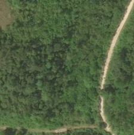
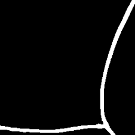
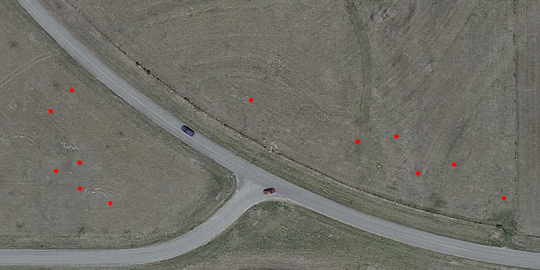
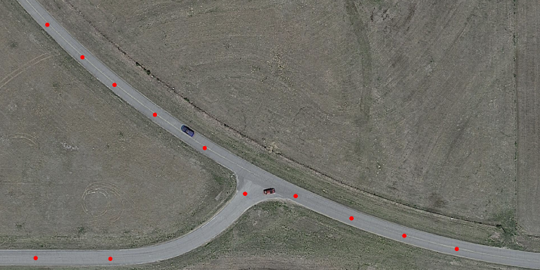

# Road Extraction and Building Detection from Aerial Imagery 

The goal of this project is to develop and train two U-Net models, convolutional neural networks (CNN) specifically designed for semantic segmentation. The objective is to extract road networks and identify buildings in aerial images. The predictions will be used to control a distributed system of drone agents, aiming to achieve optimal coverage of the road network within the environment.

For more information about the project or simulations, refer to "AndreaAlboni_BachelorThesis.pdf."

## Getting Started

List and description of the files:

- Unet.py: Defines the neural network architecture based on U-Net.
- Train.py: Trains the neural network model.
- Test.py: Tests the neural network on images of any dimension.
- smooth_predictions_by_blending_patches.py: Enhances prediction accuracy by blending patches, required during testing.
- full_img_gmm.py: ROS publisher node for cases where the entire environment is analyzed.
- img_select_gmm.py: ROS publisher node for cases where only a selected part of the environment is analyzed.
- print_pos.py: Prints the final positions of the drones as green dots on the environment screenshot.
- Simulations: Folder containing the launch files for various simulation scenarios.

### Prerequisites

Datasets required for CNN training:
- [Road Extraction Dataset](https://www.kaggle.com/datasets/balraj98/deepglobe-road-extraction-dataset)
- [Massachusetts Buildings Dataset](https://www.kaggle.com/datasets/balraj98/massachusetts-buildings-dataset/code)

Hardware prerequisites required for CNN training:
- GPU con RAM >= 8Gb
- NVIDIA GPU Drivers and [NVIDIA CUDA Toolkit](https://developer.nvidia.com/cuda-toolkit)

## Deployment

Download links for pre-trained models in ".h5" format, ready for use:
- [Road Extraction Model](https://drive.google.com/file/d/1dfdPuzAOjxv7tyFnCo3qPSDg3BL5kKfM/view?usp=sharing)
- [Buildings Detection Model](https://drive.google.com/file/d/15yyEJvJOZt-Vyrrf1LVo7sACHjIAR_w8/view?usp=sharing)

The image on the left shows an example image from the training set, and the one on the right displays the prediction generated by the U-Net for that image.

  
  

## Simulations

The simulations were conducted using real-world images from Google Maps and performed in the Gazebo simulation environment.

The following links provide downloads for the folder to be placed in .../rotors_simulator/rotors_gazebo/models, the ".dae" file for each simulation scenario to be placed in /rotors_simulator/rotors_gazebo/worlds, and a screenshot of the environment to be used for visualizing the final positions using:
- [Env - Quartiere di Reggio](https://drive.google.com/drive/folders/1L25QgqlFMfakWQTzxJSdDt4-lm1PjnNi?usp=sharing)
- [Env2 - Piazza del Colosseo](https://drive.google.com/drive/folders/1oCj5WPZFEup1hIQGeR_18bMNa0J6-P2m?usp=sharing)
- [Env4 - Strade Deserte](https://drive.google.com/drive/folders/13jji2yHSe3YBYaXJBXi-htyltGrIq8ox?usp=sharing)

To start a simulation, first ensure the folder and ".dae" file for the chosen scenario are correctly placed. Then, launch the corresponding ".launch" file for the selected environment from the terminal. Next, run one of the two environment study types, either full_img for the entire environment or img_select for a selected area, uncommenting the relevant environment information. Finally, run the "env(chosen)_coverage" file to initiate drone piloting. Run "print_pos" if you wish to display dots on the environment image indicating the drones' final positions.

The images below show the initial positions of the agents in simulation environment 4 and the final positions reached.

  
  

## Autore

  - **Andrea Alboni** 
